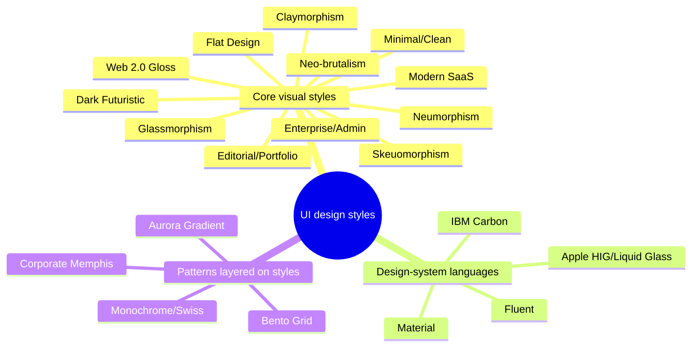
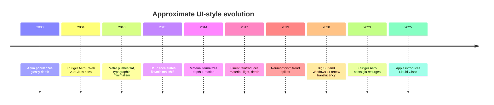

# UI Design Styles Deep Research Report

## Executive Summary

This report treats the requested styles as a mixed taxonomy: some are mature visual languages with formal documentation, some are historical paradigms, and some are market-made aesthetics with no canonical spec. The safest primary defaults for a research explorer are **Modern SaaS**, **Minimal/Clean**, and **Enterprise/Admin** because they balance recognizability, implementation ease, and accessibility. **Editorial/Portfolio** works well as a secondary expression for storytelling surfaces. **Glassmorphism**, **Neo-brutalism**, **Neumorphism**, **Claymorphism**, **Dark Futuristic**, and **Web 2.0 Gloss / Frutiger Aero** are best treated as selective or experimental appearances rather than system-wide defaults, mostly because readability, hierarchy, or long-session usability becomes harder to preserve at scale. Material, Fluent, Apple HIG / Liquid Glass, and Carbon are best understood as **design-system languages** rather than mere trends; Bento, Corporate Memphis, Aurora gradients, and Monochrome/Swiss are better modeled as **patterns layered on top of a style**. citeturn15view0turn2view1turn2view3turn18search4turn33search0turn11view0turn12view2

| Style | Visual weight | Contrast | Density | Best surface fit | A11y risk |
|---|---|---:|---|---|---|
| Modern SaaS | medium | medium-high | medium | landing, product, docs | low-medium |
| Minimal/Clean | low | high | low-medium | docs, content, productivity | low |
| Flat Design | low | medium-high | medium | app, mobile, dashboards | medium |
| Enterprise/Admin | medium | high | medium-high | data-heavy apps, admin | low |
| Editorial/Portfolio | medium | medium | low | portfolio, campaigns, storytelling | medium |
| Glassmorphism | high | low-medium | low | hero, cards, OS-like chrome | high |
| Neo-brutalism | high | high | medium | promo, creator brands, playful products | medium-high |
| Neumorphism | medium | low | low-medium | demos, niche tools | high |
| Skeuomorphism | high | medium | medium | onboarding metaphors, speciality tools | medium |
| Claymorphism | medium-high | medium | low | playful onboarding, consumer promo | medium |
| Dark Futuristic | high | medium-high | low-medium | AI, devtools, launch sites | medium |
| Web 2.0 Gloss / Frutiger Aero | high | medium | medium | nostalgia, concept art, themed promo | medium-high |

## Methodology and Taxonomy

Methodology: I prioritized official design-system documentation where it exists, then current product pages from widely recognized companies, then historical references and authoritative reporting when official pages were unavailable or JavaScript-only. The initial scope and style list also follow the user’s uploaded planning note for a UI research explorer. Exact token naming conventions were unspecified, so I use neutral proposal names such as `--bg`, `--surface`, `--text`, `--radius-md`, and `--shadow-md`. fileciteturn0file0 citeturn15view0turn2view1turn2view3turn18search4turn11view0turn12view0turn12view2turn21view0

## Research Interpretation For The Explorer

This report describes recurring visual logic, not a catalog of fixed design
systems. A style may be expressed with different fonts, imagery, palettes, and
component details while preserving its underlying hierarchy, composition,
density, surface treatment, and interaction emphasis.

Every dossier in the explorer should make three claims separately:

1. **Style principle**: what remains recognizably true across valid examples
   of the style.
2. **Demo application**: how this repository chooses to make the principle
   visible in one local layout. It is evidence, not a canonical template.
3. **Comparative cue**: what a user would notice when comparing the style with
   its closest alternatives.

Token tables and CSS snippets below are reference implementations. In the
product UI, present them as visual roles, relationships, and observed usage
before presenting exact values. A color, typeface, radius, or spacing scale
does not by itself define a style.





## Core Style Profiles

### Modern SaaS

No formal standard exists; this is a market-converged style seen on Stripe, Linear, Vercel, and recent Notion surfaces: oversized headlines, soft radii, restrained gradients, polished product screenshots, subtle borders, and roomy but not empty layouts. It is strongest on heroes, pricing, feature grids, docs, and product-led landing pages. Model it as a **balanced semantic theme** with moderate radius, soft shadows, neutral surfaces, and one or two brand accents. Priority references: Stripe, Linear, Vercel. citeturn11view0turn12view2turn21view0

| Proposed tokens | Value |
|---|---|
| Color | `#F8FAFC #FFFFFF #635BFF #0F172A #64748B` |
| Type | Inter/Geist; `15/18/40`; `500/700/800` |
| Radius | `14 / 20 / 28` |
| Shadow | `0 12px 32px rgba(15,23,42,.08)` |
| Spacing | `8 / 16 / 24 / 40` |

| Button | Card | Input | Badge |
|---|---|---|---|
| filled brand, soft radius | thin border + soft shadow | subtle border, tinted focus | low-contrast pill |

```css
.modern-saas{--bg:#f8fafc;--surface:#fff;--accent:#635bff;--radius:20px;--shadow:0 12px 32px rgba(15,23,42,.08)}
.modern-saas .preview{background:linear-gradient(180deg,#fff,#f8fafc);border:1px solid rgba(15,23,42,.08);border-radius:var(--radius);box-shadow:var(--shadow)}
```

### Minimal/Clean

Minimal/Clean emphasizes typography, whitespace, clear grouping, and low ornament. It is not the same as flat design: it may use borders, muted shadows, or editorial spacing, but decoration is intentionally sparse. It fits knowledge tools, docs, forms, and productivity surfaces, and usually offers the best baseline accessibility because hierarchy depends on size, spacing, and contrast instead of effects. Priority references: Notion Help, GitHub, Apple product pages. citeturn22view1turn27view0turn23view2

| Proposed tokens | Value |
|---|---|
| Color | `#FFFFFF #F5F5F5 #111111 #666666 #E5E7EB` |
| Type | Inter/system; `14/16/36`; `400/600/700` |
| Radius | `8 / 12 / 16` |
| Shadow | `0 1px 2px rgba(0,0,0,.04)` |
| Spacing | `8 / 16 / 24 / 48` |

| Button | Card | Input | Badge |
|---|---|---|---|
| text/outline or quiet fill | border-first, little shadow | 1px neutral border | monochrome chip |

```css
.minimal{--bg:#fff;--surface:#fff;--text:#111;--muted:#666;--radius:12px}
.minimal .preview{background:var(--surface);border:1px solid #e5e7eb;border-radius:var(--radius);box-shadow:0 1px 2px rgba(0,0,0,.04)}
```

### Flat Design

Flat design emerged as a reaction against skeuomorphic realism, especially through Microsoft’s Metro language and the broader early-2010s move toward simple shapes, flat fills, icons, and typography. Its main strength is scalability and clarity at responsive sizes; its recurring weakness is weak affordance when everything looks equally flat. In a token system, keep color and typography strong, but add selective state cues, borders, or elevation-on-interaction to avoid “too flat to click.” citeturn8search4turn17search3

| Proposed tokens | Value |
|---|---|
| Color | `#FFFFFF #0078D4 #111827 #6B7280 #D1D5DB` |
| Type | Segoe/Inter; `14/16/32`; `400/600/700` |
| Radius | `0 / 4 / 8` |
| Shadow | `none` or `0 0 0 1px rgba(0,0,0,.08)` |
| Spacing | `8 / 12 / 16 / 24` |

| Button | Card | Input | Badge |
|---|---|---|---|
| solid flat rectangle | flat pane with divider lines | border-driven | flat capsule/rect |

```css
.flat{--bg:#fff;--accent:#0078d4;--radius:4px}
.flat .preview{background:#fff;border:1px solid #d1d5db;border-radius:var(--radius);box-shadow:none}
```

### Enterprise/Admin

Enterprise/Admin prioritizes throughput, data readability, predictable states, and dense but controlled information layout. Atlassian Design and IBM Carbon exemplify the “single design language across many complex products” mindset, while GitHub Projects shows task- and table-oriented planning surfaces. This style benefits from tighter spacing scales, stronger borders, explicit status colors, and very conservative motion. Priority references: Atlassian Design, Carbon, GitHub Projects. citeturn12view1turn2view3turn27view0

| Proposed tokens | Value |
|---|---|
| Color | `#F7F8F9 #FFFFFF #357DE8 #292A2E #6B7585` |
| Type | system/IBM Plex/Segoe; `13/14/28`; `400/600/700` |
| Radius | `4 / 8 / 12` |
| Shadow | `0 1px 2px rgba(0,0,0,.05)` |
| Spacing | `4 / 8 / 12 / 16 / 24` |

| Button | Card | Input | Badge |
|---|---|---|---|
| strong primary + quiet secondary | pane or table module | clear border, error/help text | semantic status pill |

```css
.enterprise{--bg:#f7f8f9;--surface:#fff;--text:#292a2e;--radius:8px}
.enterprise .preview{background:var(--surface);border:1px solid #dfe1e6;border-radius:var(--radius);box-shadow:0 1px 2px rgba(0,0,0,.05)}
```

### Editorial/Portfolio

Editorial/Portfolio design borrows from magazine art direction: hierarchy comes from typography, rhythm, imagery, asymmetry, and pacing rather than dashboards or component density. A24, Apple’s product pages, and many Framer-built portfolio sites use cinematic imagery, large display headlines, and spacious sectional storytelling. In a theme system, separate **display type tokens** from UI-copy tokens, and allow wider spacing/rhythm presets for hero and section modules. citeturn23view1turn23view2turn29view1

| Proposed tokens | Value |
|---|---|
| Color | `#FAFAF8 #111111 #EAE7E1 #6B675F accent optional` |
| Type | display serif or geometric sans + neutral UI sans; `16/20/56`; `400/600/800` |
| Radius | `0 / 8 / 16` |
| Shadow | minimal |
| Spacing | `12 / 24 / 40 / 64` |

| Button | Card | Input | Badge |
|---|---|---|---|
| understated text or low-key fill | image-led or typographic block | often secondary | sparse, often avoided |

```css
.editorial{--bg:#fafaf8;--text:#111;--radius:8px}
.editorial .preview{background:var(--bg);border:1px solid #eae7e1;border-radius:var(--radius);box-shadow:none}
```

### Glassmorphism

Glassmorphism uses translucent layers, backdrop blur, soft borders, and depth cues to create “frosted glass” surfaces. It became feasible as GPUs made blur and compositing cheap enough for mainstream interfaces, and it overlaps with Aero, Fluent translucency, and Apple’s Liquid Glass. It is powerful for spotlight cards, overlays, nav chrome, and OS-like panels, but weak as a default for dense forms because contrast and edge detection degrade quickly. citeturn28search4turn20search1turn30search1turn30search3

| Proposed tokens | Value |
|---|---|
| Color | translucent whites + gradient backdrop: `#ffffffcc #ffffff1a #7C3AED #06B6D4` |
| Type | clean sans, medium weights; `14/16/32` |
| Radius | `16 / 24 / 32` |
| Shadow | `0 16px 40px rgba(0,0,0,.18)` |
| Spacing | `12 / 20 / 28 / 40` |

| Button | Card | Input | Badge |
|---|---|---|---|
| glossy/tinted glass | blur card + thin white stroke | translucent field | tinted translucent chip |

```css
.glass{--glass:rgba(255,255,255,.16);--stroke:rgba(255,255,255,.28);--radius:24px}
.glass .preview{backdrop-filter:blur(16px);background:var(--glass);border:1px solid var(--stroke);border-radius:var(--radius);box-shadow:0 16px 40px rgba(0,0,0,.18)}
```

### Neo-brutalism

Neo-brutalism is not a formal UI standard; it is a current web aesthetic that borrows the honesty and visual force associated with Brutalism but translates it into thick outlines, hard-offset shadows, simple geometry, bright color blocks, and intentionally “anti-polished” emphasis. It works for creator brands, playful launches, and youthful products, but it can become fatiguing across data-heavy systems. Model it with outline tokens, hard shadow presets, and a reserved palette of loud accent blocks. citeturn31search2turn26view0

| Proposed tokens | Value |
|---|---|
| Color | `#FFF78A #111111 #FFFFFF #FF6B6B #4D96FF` |
| Type | bold grotesk; `14/18/40`; `500/700/800` |
| Radius | `0 / 8 / 16` |
| Shadow | `6px 6px 0 #111` |
| Spacing | `8 / 16 / 24 / 32` |

| Button | Card | Input | Badge |
|---|---|---|---|
| loud fill + thick border | solid panel + hard shadow | heavy outline | outlined sticker-like tag |

```css
.neo-brutal{--bg:#fff78a;--ink:#111;--radius:12px}
.neo-brutal .preview{background:#fff;border:3px solid var(--ink);border-radius:var(--radius);box-shadow:6px 6px 0 var(--ink)}
```

### Neumorphism

Neumorphism, coined in 2019, sits between flat design and skeuomorphism: elements appear extruded from or inset into a same-tone background via soft dual shadows. Its strength is tactile novelty; its weakness is the same mechanism that makes it attractive: low contrast and weak affordance. Use it only as a selective skin for toggles, media controls, or wellness-style promo surfaces, never as the only hierarchy mechanism. citeturn30search2turn8search1

| Proposed tokens | Value |
|---|---|
| Color | `#E9EEF5 #DDE4EC #111827 #7C8798` |
| Type | soft sans; `14/16/30`; `400/600/700` |
| Radius | `16 / 24 / 32` |
| Shadow | `8px 8px 16px #cfd6de, -8px -8px 16px #ffffff` |
| Spacing | `10 / 16 / 24 / 32` |

| Button | Card | Input | Badge |
|---|---|---|---|
| raised pill | extruded panel | inset field | subtle embossed chip |

```css
.neumorph{--bg:#e9eef5;--radius:24px}
.neumorph .preview{background:var(--bg);border-radius:var(--radius);box-shadow:8px 8px 16px #cfd6de,-8px -8px 16px #fff}
```

### Skeuomorphism / Realistic UI

Skeuomorphism retains cues from physical objects to help users infer meaning: notebooks look bound, buttons look pressable, dials resemble dials. Historically it was dominant in early desktop and smartphone metaphors, and its rationale aligns with Norman’s discussion of perceived affordances and signifiers. Today it is best reserved for specialist tools, onboarding metaphors, productivity widgets, audio controls, or nostalgia-driven products. citeturn8search7turn13search1turn13search3

| Proposed tokens | Value |
|---|---|
| Color | material-specific: leather/metal/paper palettes |
| Type | often mixed; UI sans + themed display |
| Radius | object-dependent, often `6 / 12 / 20` |
| Shadow | layered inner + outer shadows |
| Spacing | medium, object-like padding |

| Button | Card | Input | Badge |
|---|---|---|---|
| beveled / glossy | textured object panel | framed field | engraved or stamped label |

```css
.skeuo{--surface:#f7f2e8;--radius:14px}
.skeuo .preview{background:linear-gradient(#fff8ef,#e8dcc7);border:1px solid #b79f79;border-radius:var(--radius);box-shadow:inset 0 1px 0 #fff,0 4px 10px rgba(0,0,0,.18)}
```

### Claymorphism / Soft 3D

Claymorphism is a soft-3D internet aesthetic rather than a formal pattern language. It uses inflated geometry, matte gradients, pastel palettes, oversized radii, and toy-like depth, often blending with illustration and iconography. It is effective for onboarding, education, wellness, children’s products, and playful launch sites, but too whimsical for enterprise or dense admin work. References should prioritize creative-web showcases rather than “official specs.” citeturn29view1turn26view0turn29view2

| Proposed tokens | Value |
|---|---|
| Color | `#FDE68A #F9A8D4 #93C5FD #FFFFFF #1F2937` |
| Type | friendly sans rounded; `15/18/36`; `500/700` |
| Radius | `24 / 32 / 40` |
| Shadow | `0 20px 40px rgba(31,41,55,.14)` |
| Spacing | `12 / 20 / 28 / 40` |

| Button | Card | Input | Badge |
|---|---|---|---|
| chunky pill | inflated rounded block | softly recessed field | bubbly pill |

```css
.clay{--surface:#fff;--radius:32px;--shadow:0 20px 40px rgba(31,41,55,.14)}
.clay .preview{background:linear-gradient(180deg,#fff,#fdf2f8);border-radius:var(--radius);box-shadow:var(--shadow)}
```

### Dark Futuristic / Neon Tech

This is also a market-made family rather than a single style spec. It combines dark canvases, luminous accents, gradient meshes, fine grid overlays, and high-tech motion to signal advanced tooling, AI, or developer sophistication. Vercel, Linear, and many AI launch pages use this vocabulary. Use it for splash surfaces and premium “system console” experiences, but keep data tables and form-heavy screens calmer than the hero. citeturn21view0turn12view2turn27view0

| Proposed tokens | Value |
|---|---|
| Color | `#0B1020 #111827 #22D3EE #A78BFA #E5E7EB` |
| Type | modern sans/mono mix; `14/16/40`; `500/700/800` |
| Radius | `12 / 16 / 24` |
| Shadow | `0 0 0 1px rgba(255,255,255,.08), 0 0 32px rgba(34,211,238,.12)` |
| Spacing | `8 / 16 / 24 / 40` |

| Button | Card | Input | Badge |
|---|---|---|---|
| neon or high-contrast dark CTA | dark panel + glow edge | dark field, bright focus | luminous status chip |

```css
.dark-tech{--bg:#0b1020;--surface:#111827;--accent:#22d3ee;--radius:16px}
.dark-tech .preview{background:linear-gradient(180deg,#111827,#0b1020);border:1px solid rgba(255,255,255,.08);border-radius:var(--radius);box-shadow:0 0 32px rgba(34,211,238,.12)}
```

### Web 2.0 Gloss / Frutiger Aero

Frutiger Aero describes the glossy, optimistic, eco-tech aesthetic common from roughly 2004–2013: gradients, transparency, lens flare, water, sky, leaves, and rounded glossy controls. Historically it is tied to UI languages like Windows Aero and to a broader “technology in harmony with nature” imaginary. It is useful today for nostalgia, concept work, or themed promo surfaces, but it usually feels too visually loaded for modern productivity defaults. citeturn6search4turn20search1turn20search0

| Proposed tokens | Value |
|---|---|
| Color | `#00AEEF #6EE7B7 #FFFFFF #1E3A8A #A7F3D0` |
| Type | humanist sans; `14/18/34`; `400/600/700` |
| Radius | `12 / 20 / 28` |
| Shadow | `0 10px 24px rgba(0,174,239,.22)` |
| Spacing | `8 / 16 / 24 / 32` |

| Button | Card | Input | Badge |
|---|---|---|---|
| glossy gel button | glassy rounded tile | glossy inset field | shiny orb/pill |

```css
.web20{--radius:24px}
.web20 .preview{background:linear-gradient(180deg,#c7f7ff,#67d3ff 60%,#30b7ff);border:1px solid rgba(255,255,255,.7);border-radius:var(--radius);box-shadow:inset 0 1px 0 rgba(255,255,255,.9),0 10px 24px rgba(0,174,239,.22)}
```

## Design-System Languages and Layout / Brand Patterns

**Material / Material You** formalizes three enduring principles: *material as metaphor*, bold graphic hierarchy, and motion that explains change; official guidance also specifies component behavior, accessibility, spacing, and type, making it a strong reference for a theme-first token system. **Fluent** reintroduces light, depth, motion, material, and scale after Metro’s flatter phase, and is especially useful when modeling translucent surfaces that must still behave like system UI. **Apple HIG / Liquid Glass** is best read as a platform-native material-and-motion language centered on hierarchy between content and controls; its risks become obvious when transparency outpaces legibility. **IBM Carbon** is the most enterprise-oriented of the group, pairing IBM Design Language foundations with reusable assets and strong product-scale governance. citeturn15view0turn15view1turn2view1turn30search3turn18search4turn2view3turn10search2

**Bento Grid** is a layout pattern, not a style: use variable card spans and modular feature tiles on top of Modern SaaS, Dark Futuristic, or Minimal/Clean surfaces. **Corporate Memphis** is a brand-illustration language, not a component system; use it in hero art or onboarding if you need approachable big-tech-style illustration. **Aurora / Mesh Gradient** is a background treatment that works best as a brand layer for SaaS, Dark Futuristic, or Glassmorphism. **Monochrome / Swiss** is a typographic and grid discipline rooted in Swiss Style: asymmetry, modular grids, sans-serif type, strong alignment, and wide whitespace. citeturn32search6turn32news3turn33search0turn24search4turn23view2turn21view0

## Theme-First Modeling Matrix and Recommendations

For a theme-first system, model each appearance as a bundle of semantic decisions instead of raw utility classes: palette family, surface treatment, type family, radius scale, shadow preset, density preset, and motion recipe. This keeps the same component tree reusable while changing only token groups and a small number of variant rules. The generic preview scaffold below is sufficient for a research explorer; each style snippet above can restyle it without changing structure. citeturn15view0turn2view1turn2view3turn18search4

| Style | Palette family | Radius default | Shadow preset | Type family | Density |
|---|---|---|---|---|---|
| Modern SaaS | neutral + brand tint | soft | soft-depth | Inter/Geist | medium |
| Minimal/Clean | neutral grayscale | small-soft | minimal | Inter/system | low-medium |
| Flat Design | flat solids | small | none/hairline | Segoe/Inter | medium |
| Enterprise/Admin | neutral + semantic status | small | low | IBM Plex/Segoe/system | medium-high |
| Editorial/Portfolio | neutral + art-directed accent | mixed | minimal | display + UI sans | low |
| Glassmorphism | translucent + gradient backdrop | large | glass-depth | clean sans | low |
| Neo-brutalism | loud blocks + black ink | small-medium | hard-offset | bold grotesk | medium |
| Neumorphism | monochrome pastel | large | dual-soft | soft sans | low-medium |
| Skeuomorphism | material-specific | contextual | layered | mixed | medium |
| Claymorphism | pastel playful | very large | puffed | rounded sans | low |
| Dark Futuristic | dark neutrals + neon accents | medium | glow-edge | sans + mono | low-medium |
| Web 2.0 Gloss | bright aqua/eco-tech | large | glossy depth | humanist sans | medium |

```jsx
export function Preview({ className = "", title = "Preview" }) {
  return (
    <section className={`preview ${className}`}>
      <nav className="nav">Logo · Docs · Pricing</nav>
      <h3>{title}</h3>
      <p>A shared component scaffold for theme-level style swaps.</p>
      <input placeholder="Your email" />
      <button>Get started</button>
      <span className="badge">Status</span>
    </section>
  );
}
```

Final recommendation for a UI research explorer: make **Modern SaaS** the primary default, add **Minimal/Clean** and **Enterprise/Admin** as production-safe comparison baselines, keep **Editorial/Portfolio** as a narrative secondary theme, and mark **Glassmorphism**, **Neo-brutalism**, **Neumorphism**, **Claymorphism**, **Dark Futuristic**, and **Web 2.0 Gloss / Frutiger Aero** as experimental appearances. Treat **Material**, **Fluent**, **Apple HIG / Liquid Glass**, and **Carbon** as reference languages informing tokens and behaviors rather than equal-weight “styles,” and treat **Bento**, **Corporate Memphis**, **Aurora**, and **Monochrome/Swiss** as overlays or patterns that can be combined with multiple base styles. That structure gives the explorer clear taxonomy, strong defaults, and enough visual range to teach meaningful differences without confusing style, system, and pattern into one bucket. citeturn11view0turn22view1turn12view1turn2view3turn23view1turn28search4turn30search2turn18search4turn33search0
